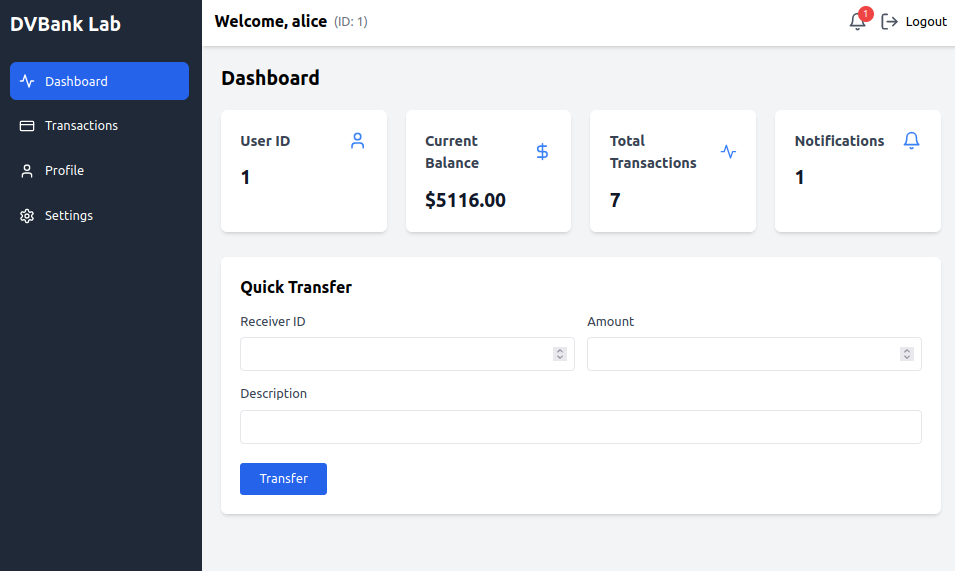
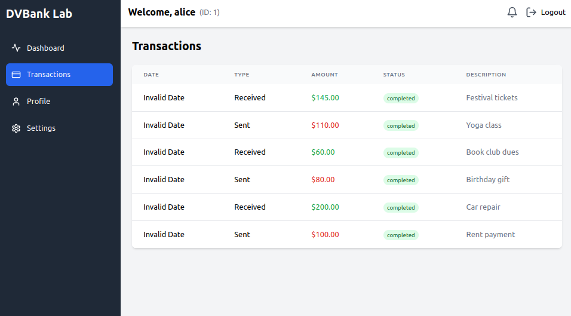
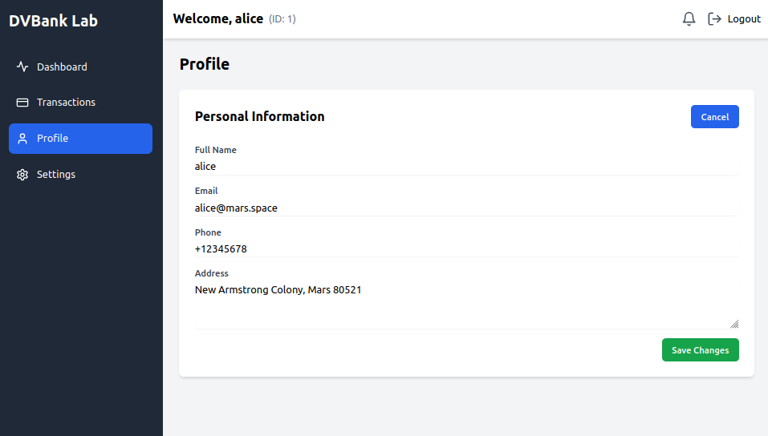

# DVBank Lab: Hands-on Web Security with Python & React
## A Practical Guide to Secure Code Review and Web Application Security

Welcome to DVBank Lab, an intentionally vulnerable banking application designed for learning secure code review and web application security. This project serves as both a hands-on learning environment and a comprehensive course in identifying, understanding, and fixing security vulnerabilities.

> Inspired by [DVWA (Damn Vulnerable Web Application)](https://github.com/digininja/DVWA), this project aims to provide a modern, full-stack vulnerable application specifically focused on banking security scenarios.

## 🎯 Demo

### Dashboard


### Transaction System


### Profile Features



## 🎯 Educational Objectives

This project helps you master:
- Secure code review techniques
- Vulnerability identification and exploitation
- Security fix implementation
- Security assessment methodologies
- Secure coding practices

## 🛠️ Technology Stack

### Backend
- Python 3.9+
- Flask Framework
- SQLAlchemy ORM
- JWT Authentication
- SQLite Database

### Frontend
- React 18
- TailwindCSS
- Lucide Icons
- Modern UI/UX

### Development & Deployment
- Docker & Docker Compose
- Git Version Control
- Development Tools Integration

## 📚 Course Modules

0. **Security Assessment Methodology**
   - Systematic security review approaches
   - Threat modeling techniques
   - Risk assessment frameworks

1. **SQL Injection Vulnerabilities**
   - Understanding SQL injection vectors
   - Real-world exploitation examples
   - Implementation of secure queries

2. **Authentication & Authorization**
   - JWT security considerations
   - Session management best practices
   - Access control implementation

3. **Input Validation & Sanitization**
   - Data validation strategies
   - Type conversion security
   - Input sanitization techniques

4. **API Security**
   - CORS security configuration
   - Rate limiting implementation
   - Secure error handling

5. **Secure Coding Practices**
   - Password security
   - Secure logging practices
   - Transaction integrity

## 🚀 Module Index

Detailed course materials can be found in the following files:

| Module | Description | Link |
|--------|-------------|------|
| 0. Methodology | Learn systematic approaches to security assessment and code review | [📘 Module 0](course/modules/00_methodology.md) |
| 1. SQL Injection | Understanding and exploiting SQL injection vulnerabilities | [📘 Module 1](course/modules/01_sql_injection.md) |
| 2. Auth & Authz | Authentication and authorization vulnerabilities | [📘 Module 2](course/modules/02_auth_and_authz.md) |
| 3. Input Validation | Input validation and sanitization techniques | [📘 Module 3](course/modules/03_input_validation.md) |

Each module contains:
- Theoretical background
- Vulnerable code examples
- Exploitation techniques
- Prevention methods
- Hands-on exercises
- Additional resources

## 🚀 Quick Start

### Prerequisites
- Python 3.9 or higher
- Node.js 16 or higher
- Docker and Docker Compose (optional)
- Git

### Docker Setup (Recommended)

```bash
# Clone repository
git clone https://github.com/yourusername/vulnerable-bank.git
cd vulnerable-bank

# Launch application
docker-compose up --build
```

### Manual Setup

#### Backend (Python/Flask)
```bash
# Setup Python environment
cd backend
python -m venv venv

# Activate virtual environment
source venv/bin/activate  # Linux/macOS
.\venv\Scripts\activate   # Windows

# Install dependencies
pip install -r requirements.txt

# Start server
python app.py
```

#### Frontend (React)
```bash
# In a new terminal
cd frontend
npm install
npm start
```

### Access the Application
- Frontend: http://localhost:3000
- Backend API: http://localhost:5000

### Test Credentials
- Username: alice, Password: password123
- Username: bob, Password: password123

## 🏗️ Project Structure
```
vulnerable-bank/
├── backend/                  # Flask backend
│   ├── routes/              # API endpoints
│   │   ├── auth_routes.py   # Authentication
│   │   └── transaction_routes.py  # Transactions
│   ├── app.py              # Main application
│   ├── models.py           # Database models
│   └── requirements.txt    # Python dependencies
├── frontend/               # React frontend
│   ├── src/
│   │   ├── components/    # React components
│   │   └── App.js        # Main app component
│   └── package.json      # Node dependencies
├── course/               # Educational content
│   ├── modules/         # Course modules
│   └── exercises/       # Practice materials
└── docker-compose.yml   # Docker configuration
```

## 🔒 Security Features

### Authentication System
- JWT-based authentication
- Password hashing
- Session management

### Transaction System
- Money transfers
- Balance tracking
- Transaction history

### User Management
- User registration
- Profile management
- Role-based access

## 🎯 Learning Objectives

### Vulnerability Categories
1. Authentication Bypass
2. Authorization Flaws
3. Input Validation
4. Business Logic Flaws
5. API Security Issues

### Security Skills
1. Code Review Techniques
2. Vulnerability Assessment
3. Security Testing
4. Fix Implementation

## ⚠️ Security Notice

This application contains **INTENTIONAL** security vulnerabilities for educational purposes:
1. SQL Injection vulnerabilities
2. Insecure JWT implementation
3. Missing input validation
4. IDOR vulnerabilities
5. Race conditions
6. Weak password policies

**DO NOT:**
- Deploy to production
- Use real credentials
- Use production data
- Host publicly

## 🤝 Contributing

We welcome contributions! Please:
1. Fork the repository
2. Create a feature branch
3. Submit a pull request
4. Follow security guidelines

## 📚 Additional Resources

### Documentation
- [Course Modules](./course/README.md)
- [Installation Guide](#-quick-start)

### External Resources
- [OWASP Top 10](https://owasp.org/www-project-top-ten/)
- [Flask Security](https://flask.palletsprojects.com/en/stable/web-security/)


## 🙏 Acknowledgments
- OWASP Foundation
- [DVWA](https://github.com/digininja/DVWA) - The original inspiration for this project
- Security research community
- Open source contributors

## ⚠️ Disclaimer
This application contains intentional security vulnerabilities for educational purposes. The creators are not responsible for any misuse or damage caused by this application. Use at your own risk and only in a controlled, isolated environment. 

---

## Legal Notice

© 2024 All Rights Reserved.

This educational material is provided for learning purposes only. The code examples and vulnerabilities demonstrated are for educational use in a controlled environment. The authors and contributors are not responsible for any misuse of the information provided.

_Note: All code examples contain intentional vulnerabilities for educational purposes. Do not use in production environments._ 