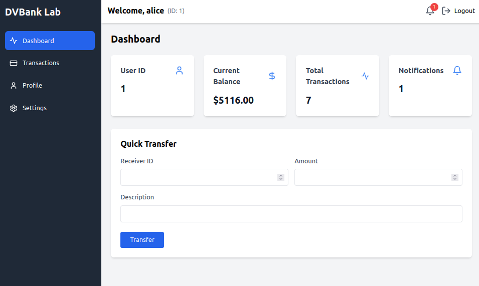
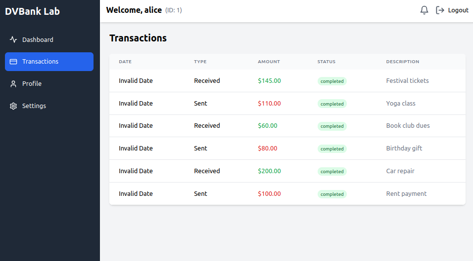
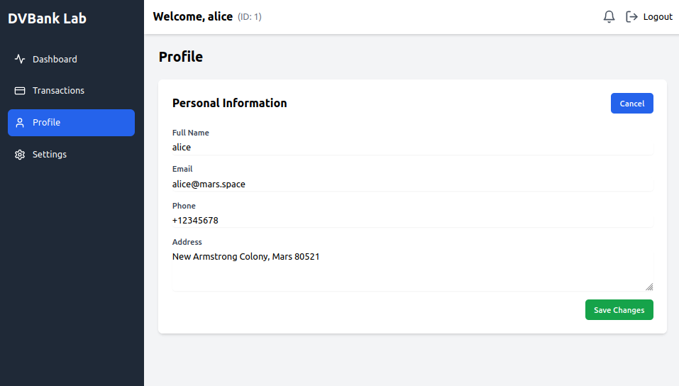

# DVBank Lab: Hands-on Web Security & AI Security Evaluation Benchmark
## A vulnerable banking app for secure code review — and an AI eval / LLM security benchmark

Welcome to DVBank Lab, an intentionally vulnerable banking application designed for learning secure code review and web application security. This project serves as both a hands-on learning environment and a comprehensive course in identifying, understanding, and fixing security vulnerabilities.

It also doubles as an **AI security evaluation benchmark** — a reproducible way to measure how well AI/LLM coding agents **detect and exploit** real web-application vulnerabilities (see [🤖 AI Security Evaluation Benchmark](#-ai-security-evaluation-benchmark-ai-evals)).

> Inspired by [DVWA (Damn Vulnerable Web Application)](https://github.com/digininja/DVWA), this project aims to provide a modern, full-stack vulnerable application specifically focused on banking security scenarios.

## 🤖 AI Security Evaluation Benchmark (AI Evals)

**DVBank is also an AI security evaluation benchmark** — a reproducible **benchmark for evaluating AI and LLM coding agents on real web-application security tasks**. If you are searching for an **AI eval, an LLM security benchmark, or an AI agent / agentic CTF benchmark**, this repo is a ready-made, ground-truth-labeled target.

It measures two capabilities:

1. **Vulnerability detection (static)** — can a model *find* the bugs? Scored as precision / recall / F1 against a machine-readable answer key of **53 labeled vulnerabilities** (CWE + OWASP Top 10 2021), with planted **decoys** to measure the false-positive rate.
2. **Agentic exploitation (CTF)** — can an agent *exploit* a running target? **16 oracle-graded capture-the-flag challenges** (JWT forgery, SQL injection, IDOR, SSRF, XXE, RCE via eval / pickle / YAML, OS command injection, path traversal, file-upload XSS, account takeover, …), each pass/failed by a deterministic oracle.

**Contamination-resistant by design:** the benchmark runs against a de-leaked `clean/` variant (answer-revealing comments and docs stripped) plus programmatically **mutated, held-out variants**, so a model can't just read the answers — and the public repo can't simply be memorized.

➡️ Everything lives in **[`eval/`](./eval/)** — see **[`eval/README.md`](./eval/README.md)** to run it.

```bash
# Static vulnerability-detection scoring (precision / recall / F1 + decoy FP-rate)
python eval/graders/detection_grader.py --truth eval/ground_truth.json \
  --findings <model_findings.json> --decoys eval/decoys/manifest.json

# Agentic CTF: validate the benchmark, serve a target, then grade an agent's answers
python eval/harness/run_ctf.py selftest
python eval/harness/run_ctf.py serve
python eval/harness/run_ctf.py grade --submissions answers.json
```

> **Topics / keywords:** AI eval · AI evaluation benchmark · LLM security benchmark · AI agent security evaluation · vulnerability detection benchmark · agentic CTF benchmark · AI red-teaming · secure-code-review benchmark · OWASP / CWE benchmark for LLMs.

## 🎯 Demo

### Dashboard


### Transaction System


### Profile Features



## 🎯 Educational Objectives

This project helps you master:
- Secure code review techniques
- Vulnerability identification and exploitation
- Security fix implementation
- Security assessment methodologies
- Secure coding practices

## 🛠️ Technology Stack

### Backend
- Python 3.9+
- Flask Framework
- SQLAlchemy ORM
- JWT Authentication
- SQLite Database

### Frontend
- React 18
- TailwindCSS
- Lucide Icons
- Modern UI/UX

### Development & Deployment
- Docker & Docker Compose
- Git Version Control
- Development Tools Integration

## 📚 Module Index

Detailed course materials can be found in the following files:

| Module | Description | Link |
|--------|-------------|------|
| 0. Methodology | Secure Code Review Methodology | [📘 Module 0](course/modules/00_methodology.md) |
| 1. Application Reconnaissance | Application Reconnaissance & Attack Surface Mapping | [📘 Module 1](course/modules/01_recon_and_mapping.md) |
| 2. Software Composition Analysis | Dependency Security Analysis | [📘 Module 2](course/modules/02_sca.md) |
| 3. Authentication & Authorization | Authentication & Authorization Vulnerabilities | [📘 Module 3](course/modules/03_auth_and_authz.md) |
| 4. SQL Injection | SQL Injection Vulnerabilities | [📘 Module 4](course/modules/04_sql_injection.md) |
| 5. Input Validation | Input Validation Vulnerabilities | [📘 Module 5](course/modules/05_input_validation.md) |
| 6. API Security | API Security Best Practices | [📘 Module 6](course/modules/06_api_security.md) |
| 7. Secure Coding | Secure Coding Practices | [📘 Module 7](course/modules/07_secure_coding.md) |
| 8. Static Analysis | Automated Static Analysis with Semgrep | [📘 Module 8](course/modules/08_static_analysis.md) |
| 9. CSRF & Clickjacking | Cross-Site Request Forgery & UI Redressing | [📘 Module 9](course/modules/09_csrf_and_clickjacking.md) |
| 10. Stored XSS & File Upload | Output Encoding & Upload Security | [📘 Module 10](course/modules/10_xss_and_file_upload.md) |
| 11. Auth Bypass & Business Logic | JWT Bypass, Insecure Reset, Race Conditions | [📘 Module 11](course/modules/11_auth_bypass_and_business_logic.md) |


Each module contains:
- Theoretical background
- Vulnerable code examples
- Exploitation techniques
- Prevention methods
- Hands-on exercises
- Additional resources

## 🚀 Quick Start

### Prerequisites
- Python 3.9 or higher
- Node.js 16 or higher
- Docker and Docker Compose (optional)
- Git

### Docker Setup (Recommended)

```bash
# Clone repository
git clone https://github.com/mamgad/DVBLab.git
cd DVBLab

# Launch application
docker-compose up --build
```

### Manual Setup

#### Backend (Python/Flask)
```bash
# Clone repository
git clone https://github.com/mamgad/DVBLab.git
cd DVBLab

# Backend setup
cd backend
python -m venv venv

# Activate virtual environment
source venv/bin/activate  # Linux/macOS
.\venv\Scripts\activate   # Windows

# Install dependencies
pip install -r requirements.txt

# Start server
python app.py
```

#### Frontend (React)
```bash
# In a new terminal
cd frontend
npm install
npm start
```

### Access the Application
- Frontend: http://localhost:3000
- Backend API: http://localhost:5000

### Test Credentials
- Username: alice, Password: password123
- Username: bob, Password: password123

## 🏗️ Project Structure
```
vulnerable-bank/
├── backend/                  # Flask backend
│   ├── routes/              # API endpoints
│   │   ├── auth_routes.py   # Authentication
│   │   └── transaction_routes.py  # Transactions
│   ├── app.py              # Main application
│   ├── models.py           # Database models
│   └── requirements.txt    # Python dependencies
├── frontend/               # React frontend
│   ├── src/
│   │   ├── components/    # React components
│   │   └── App.js        # Main app component
│   └── package.json      # Node dependencies
├── course/               # Educational content
│   └── modules/         # Course modules (0–11)
├── docs/
│   ├── Vulnerabilities.md   # Full vulnerability inventory
│   └── exploits/            # Working exploit PoCs
├── eval/                 # 🤖 AI security evaluation benchmark
│   ├── ground_truth.json    # 53 labeled vulns (answer key)
│   ├── flags.json           # 16 agentic CTF challenges
│   ├── graders/             # detection_grader.py + ctf_oracles.py
│   ├── harness/             # run_ctf.py (selftest / serve / grade)
│   ├── variants/            # clean (de-leaked) + mutated (held-out) targets
│   └── decoys/              # safe-but-suspicious code (false-positive test)
└── docker-compose.yml   # Docker configuration
```

## 🔒 Security Features

### Authentication System
- JWT-based authentication
- Password hashing
- Session management

### Transaction System
- Money transfers
- Balance tracking
- Transaction history

### User Management
- User registration
- Profile management
- Role-based access

## 🎯 Learning Objectives

### Vulnerability Categories
1. Authentication Bypass
2. Authorization Flaws
3. Input Validation
4. Business Logic Flaws
5. API Security Issues

### Security Skills
1. Code Review Techniques
2. Vulnerability Assessment
3. Security Testing
4. Fix Implementation

## ⚠️ Security Notice

This application contains **INTENTIONAL** security vulnerabilities for educational purposes:
1. SQL Injection vulnerabilities
2. Insecure JWT implementation
3. Missing input validation
4. IDOR vulnerabilities
5. Race conditions
6. Weak password policies

**DO NOT:**
- Deploy to production
- Use real credentials
- Use production data
- Host publicly

## 🤝 Contributing

We welcome contributions! Please:
1. Fork the repository
2. Create a feature branch
3. Submit a pull request
4. Follow security guidelines

## 📚 Additional Resources

### Documentation
- [Course Modules](./course/README.md)
- [Installation Guide](#-quick-start)
- [Known Vulnerabilities](./docs/Vulnerabilities.md) - Detailed list of intentional security issues

### External Resources
- [OWASP Top 10](https://owasp.org/www-project-top-ten/)
- [Flask Security](https://flask.palletsprojects.com/en/stable/web-security/)


## 🙏 Acknowledgments
- OWASP Foundation
- [DVWA](https://github.com/digininja/DVWA) - The original inspiration for this project
- Security research community
- Open source contributors

## ⚠️ Disclaimer
This application contains intentional security vulnerabilities for educational purposes. The creators are not responsible for any misuse or damage caused by this application. Use at your own risk and only in a controlled, isolated environment. 

---

## Legal Notice

© 2024 All Rights Reserved.

This educational material is provided for learning purposes only. The code examples and vulnerabilities demonstrated are for educational use in a controlled environment. The authors and contributors are not responsible for any misuse of the information provided.

_Note: All code examples contain intentional vulnerabilities for educational purposes. Do not use in production environments._ 
